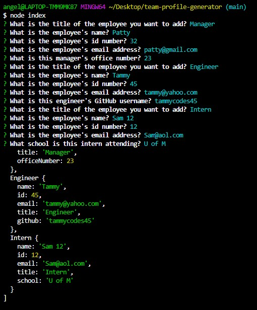

# team-profile-generator

## Description

This is an application run through node.js that generates a webpage featuring employee profiles. 

## Built With

-  Javascript
-  HTML
-  Inquirer
-  Bootstrap
-  Tested using Jest

##  Demo

-  View a demo video of this application here: https://drive.google.com/file/d/1A47bfzYTnzZGWzAj6-AlFEctET9kU6TJ/view?usp=sharing

-  Screenshots of node prompts and resulting webpage:

## Usage

This application can only be run if the user downloads all the files included to their own computer.  It is then launched through the command terminal by typing "node index".  The user answers the series of prompts to generate the HTML for the webpage.  

## Credits
-  Created by Angela Gustafson (angiebunk1)